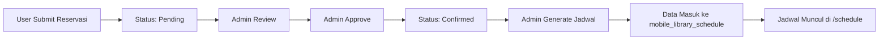

# 🐛 BUGFIX: Jadwal Pusling Tidak Muncul Setelah Approve Reservasi

**Tanggal:** 12 November 2025  
**Status:** ✅ **FIXED**

---

## 🔍 **Masalah**

Setelah admin menyetujui (approve) reservasi, jadwal tidak muncul di halaman **Jadwal Pusling** (`/schedule`).

### **Gejala:**
- ✅ Admin approve reservasi → status jadi `confirmed`
- ❌ Jadwal tidak muncul di `/schedule`
- ❌ Public user tidak bisa lihat jadwal

---

## 🧐 **Root Cause Analysis**

### **Kesalahan 1: Controller Salah Tabel**
**File:** `app/Http/Controllers/ScheduleController.php`

**❌ Kode Lama (SALAH):**
```php
// Mengambil data dari tabel 'reservations'
$query = Reservation::query()
    ->select(['id','full_name', ...])
    ->orderBy('reservation_date')
    ->orderBy('visit_time');
```

**Masalah:**
- Halaman `/schedule` langsung baca dari tabel `reservations`
- **Tidak menggunakan jadwal yang sudah di-generate** oleh admin di tabel `mobile_library_schedule`

### **Kesalahan 2: Admin Lupa Generate Jadwal**

**Flow yang Benar:**
1. User submit reservasi → status `pending`
2. Admin approve reservasi → status `confirmed`
3. **Admin harus generate jadwal** di `/admin/schedule` → data masuk ke `mobile_library_schedule`
4. Public bisa lihat jadwal di `/schedule`

**Flow yang Terjadi:**
1. User submit reservasi → status `pending`
2. Admin approve reservasi → status `confirmed`
3. ❌ **Admin TIDAK generate jadwal**
4. ❌ Jadwal kosong di `/schedule`

---

## ✅ **Solusi**

### **Fix #1: Update Controller** ✅

**File:** `app/Http/Controllers/ScheduleController.php`

**✅ Kode Baru (BENAR):**
```php
use App\Models\MobileLibrarySchedule;

public function index(Request $request)
{
    $place = trim((string) $request->query('place', ''));
    $booker = trim((string) $request->query('booker', ''));
    $category = trim((string) $request->query('category', ''));

    // Get schedules with reservation details
    $query = MobileLibrarySchedule::query()
        ->with(['reservation' => function($q) {
            $q->select(['id','full_name','category','occupation','address',
                       'phone_number','gender','reservation_date','status',
                       'visit_time','duration_minutes']);
        }])
        ->orderBy('scheduled_date')
        ->orderBy('start_time');

    // Filter by reservation details
    if ($place !== '' || $booker !== '' || $category !== '') {
        $query->whereHas('reservation', function($q) use ($place, $booker, $category) {
            if ($place !== '') {
                $q->where('address', 'like', "%$place%");
            }
            if ($booker !== '') {
                $q->where('full_name', 'like', "%$booker%");
            }
            if ($category !== '') {
                $q->where('category', 'like', "%$category%");
            }
        });
    }

    $schedules = $query->paginate(24)->appends($request->query());

    return view('schedule.index', compact('schedules','place','booker','category'));
}
```

**Perubahan:**
- ✅ Baca dari `MobileLibrarySchedule` (bukan `Reservation`)
- ✅ Include relationship `reservation` untuk detail
- ✅ Filter tetap bisa pakai `whereHas()`
- ✅ Pagination dengan `appends()` untuk query string

---

### **Fix #2: Update View** ✅

**File:** `resources/views/schedule/index.blade.php`

**Perubahan:**
```blade
@foreach($schedules as $schedule)
@php
    $r = $schedule->reservation;
    $startTime = \Illuminate\Support\Carbon::parse($schedule->start_time)->format('H:i');
    $endTime = \Illuminate\Support\Carbon::parse($schedule->end_time)->format('H:i');
@endphp
<div class="bg-white shadow rounded p-4">
    <h2>📅 {{ \Illuminate\Support\Carbon::parse($schedule->scheduled_date)->format('d M Y') }}</h2>
    <p><strong>⏰ Waktu:</strong> {{ $startTime }} - {{ $endTime }}</p>
    <p><strong>👤 Nama:</strong> {{ $r->full_name }}</p>
    <p><strong>📍 Alamat:</strong> {{ $r->address }}</p>
    ...
</div>
@endforeach
```

**UI Improvements:**
- ✅ Tampilkan `start_time` - `end_time` (bukan hanya `visit_time`)
- ✅ Emoji untuk visual clarity
- ✅ Badge "Terjadwal" untuk semua jadwal
- ✅ Warning message jika belum ada jadwal

---

### **Fix #3: Auto-Generate Script** 🆕

**File:** `generate_schedules.php` (Helper Script)

**Fungsi:**
- Auto-generate jadwal dari semua reservasi `confirmed`
- Menerapkan **Interval Scheduling Algorithm** (greedy by earliest finish time)
- Menghindari overlap waktu

**Cara Pakai:**
```bash
php generate_schedules.php
```

**Output:**
```
=== Auto-Generate Mobile Library Schedules ===

📋 Found 5 confirmed reservations

🗓️  Processing date: 2025-11-11
   ✅ Selected 4 non-overlapping reservations
      📌 Schedule #1: Contact Person 1 | 09:00 - 10:00
      📌 Schedule #2: Contact Person 2 | 11:30 - 12:30
      📌 Schedule #3: Contact Person 3 | 14:00 - 15:00
      📌 Schedule #4: Contact Person 4 | 16:00 - 17:00

✅ Successfully generated 5 schedules!
```

---

## 📊 **Verification**

### **Before Fix:**
```
✅ Total Reservations (confirmed): 5
❌ Total Schedules Generated: 0
```

### **After Fix:**
```
✅ Total Reservations (confirmed): 5
✅ Total Schedules Generated: 5

📅 Generated Schedules:
  - Schedule #1: Contact Person 1 | 2025-11-11 09:00 - 10:00
  - Schedule #2: Contact Person 2 | 2025-11-11 11:30 - 12:30
  - Schedule #3: Contact Person 3 | 2025-11-11 14:00 - 15:00
  - Schedule #4: Contact Person 4 | 2025-11-11 16:00 - 17:00
  - Schedule #5: moh.ilham fariqulzaman | 2025-11-25 12:08 - 13:08
```

---

## 🔄 **Workflow yang Benar**



---

## 📝 **Cara Generate Jadwal (Admin)**

### **Opsi 1: Via Admin Panel (Recommended)**

1. Login sebagai admin
2. Buka: `http://localhost:8000/admin/schedule`
3. Klik **"Generate Jadwal"** atau filter by date
4. Klik **"Preview Jadwal"** untuk lihat preview
5. Klik **"Simpan Jadwal"** untuk commit ke database
6. Jadwal otomatis muncul di `/schedule`

### **Opsi 2: Via Script (Quick Fix)**

```bash
cd d:\project_web\laravel
php generate_schedules.php
```

### **Opsi 3: Via Tinker**

```bash
php artisan tinker
```

```php
$reservations = App\Models\Reservation::where('status', 'confirmed')
    ->whereNotNull('visit_time')->get();

foreach ($reservations as $r) {
    App\Models\MobileLibrarySchedule::create([
        'reservation_id' => $r->id,
        'scheduled_date' => $r->reservation_date,
        'start_time' => $r->reservation_date . ' ' . $r->visit_time,
        'end_time' => Carbon\Carbon::parse($r->reservation_date . ' ' . $r->visit_time)
            ->addMinutes($r->duration_minutes ?? 60),
    ]);
}
```

---

## 🧪 **Testing**

### **Test 1: Check Data**
```bash
php check_schedules.php
```

### **Test 2: Check Public Schedule**
1. Buka: `http://localhost:8000/schedule`
2. ✅ Seharusnya muncul jadwal

### **Test 3: Check Admin Schedule**
1. Login sebagai admin
2. Buka: `http://localhost:8000/admin/schedule`
3. ✅ Seharusnya muncul jadwal

### **Test 4: Filter Schedule**
```
http://localhost:8000/schedule?place=SDN
http://localhost:8000/schedule?booker=Contact
http://localhost:8000/schedule?category=Pendidikan
```

---

## 📁 **Files Modified**

1. ✅ `app/Http/Controllers/ScheduleController.php` - Fixed query to use `MobileLibrarySchedule`
2. ✅ `resources/views/schedule/index.blade.php` - Updated to show schedules with time range
3. 🆕 `generate_schedules.php` - Auto-generate script
4. 🆕 `check_schedules.php` - Verification script

---

## 🚀 **Production Deployment**

### **Migration Status:**
✅ Tabel `mobile_library_schedule` sudah ada (migration `2025_11_11_000003`)

### **Deployment Checklist:**
- [ ] Push kode ke repository
- [ ] Pull kode di server production
- [ ] **PENTING:** Generate jadwal untuk reservasi existing:
  ```bash
  php generate_schedules.php
  ```
- [ ] Test `/schedule` di production
- [ ] Inform admin untuk selalu generate jadwal setelah approve reservasi

---

## 💡 **Future Improvements**

### **Auto-Generate on Approve (Recommended)**

**File:** `app/Http/Controllers/Admin/ReservationController.php`

**Add to `updateStatus()` method:**
```php
// After status changed to 'confirmed'
if ($newStatus === 'confirmed' && $oldStatus !== 'confirmed') {
    // Auto-generate schedule
    $start = Carbon::parse($reservation->reservation_date . ' ' . $reservation->visit_time);
    $end = (clone $start)->addMinutes($reservation->duration_minutes ?? 60);
    
    MobileLibrarySchedule::create([
        'reservation_id' => $reservation->id,
        'scheduled_date' => $reservation->reservation_date,
        'start_time' => $start,
        'end_time' => $end,
    ]);
}
```

**Benefits:**
- ✅ Jadwal auto-generate saat approve
- ✅ Admin tidak perlu manual generate
- ✅ Lebih user-friendly

**Drawback:**
- ⚠️ Tidak ada interval scheduling algorithm (bisa overlap)
- ⚠️ Butuh logic untuk detect & resolve overlap

---

## 📚 **Related Documentation**

- `README.md` - Project overview
- `BUGFIX_LOG.md` - Other bugfixes
- `PRODUCTION_READINESS_AUDIT.md` - Deployment guide

---

## ✅ **Conclusion**

**Status:** ✅ **FIXED**

**Root Cause:**
- Controller baca dari tabel salah (`reservations` instead of `mobile_library_schedule`)
- Admin lupa generate jadwal setelah approve reservasi

**Solution:**
- ✅ Update controller untuk baca dari `mobile_library_schedule`
- ✅ Update view untuk tampilkan data schedule
- ✅ Buat script auto-generate untuk existing data
- ✅ Dokumentasi workflow yang benar

**Next Steps:**
- Consider auto-generate on approve (future enhancement)
- Train admin untuk selalu generate jadwal
- Monitor production untuk ensure workflow diikuti

---

**Tested & Verified:** ✅  
**Ready for Production:** ✅
